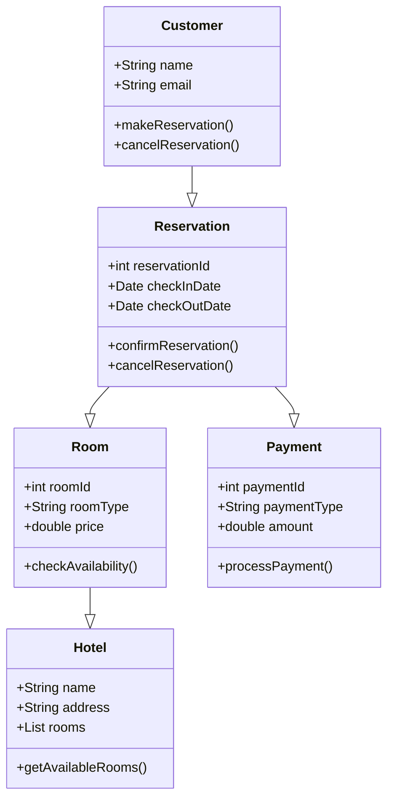
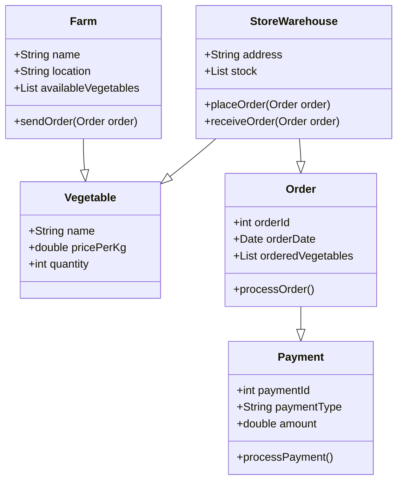
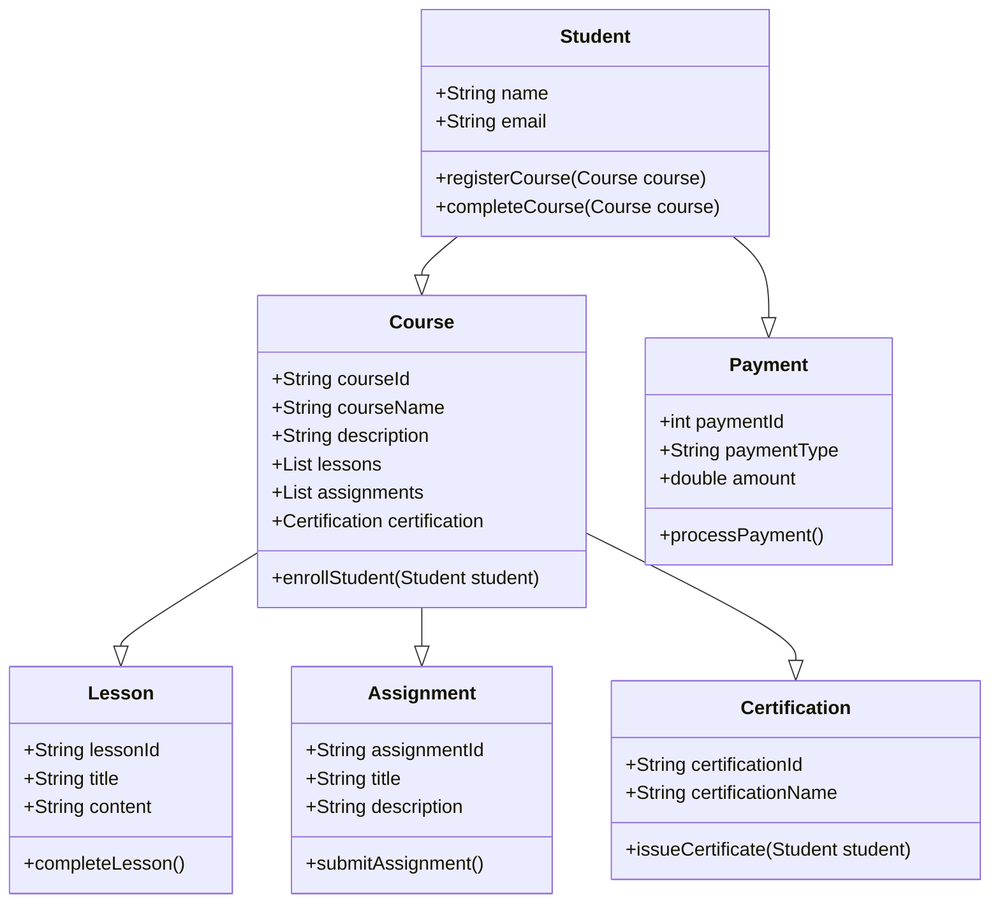
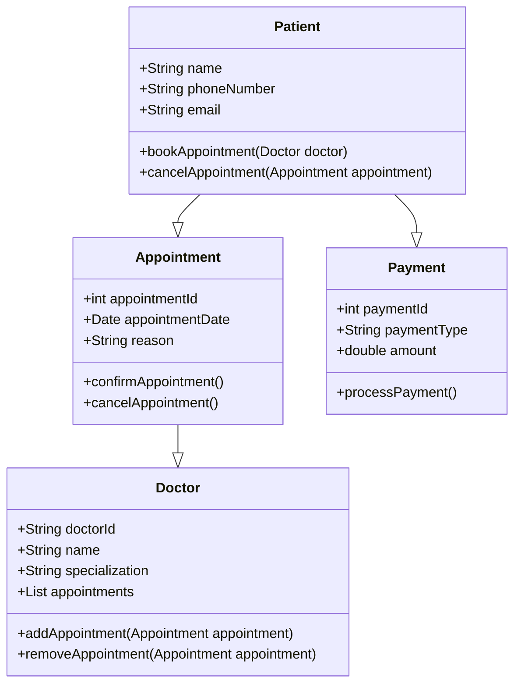
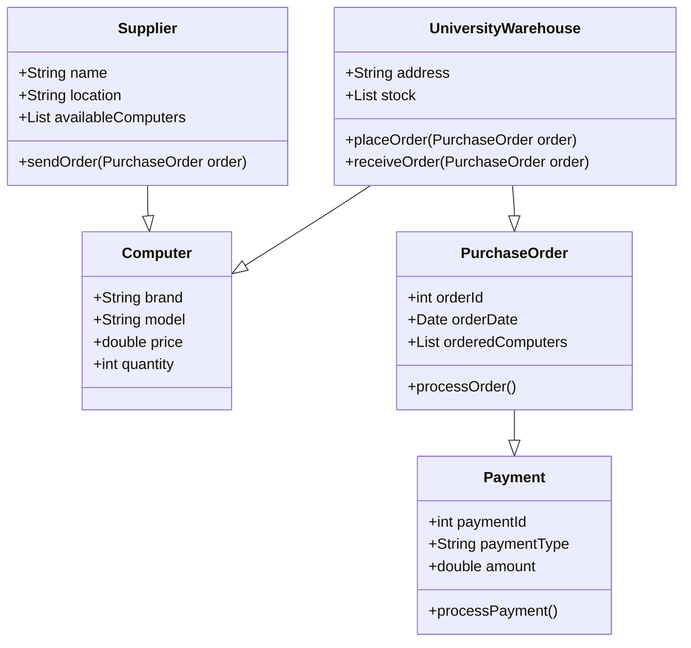

# 1. Бронирование номера в отеле  

# 2. Оптовая закупка овощей из фермы на склад магазина

# 3. Прохождение онлайн-курсов по программированию

# 4. Запись к врачу через мобильное приложение

# 5. Оптовая закупка компьютеров в университет

